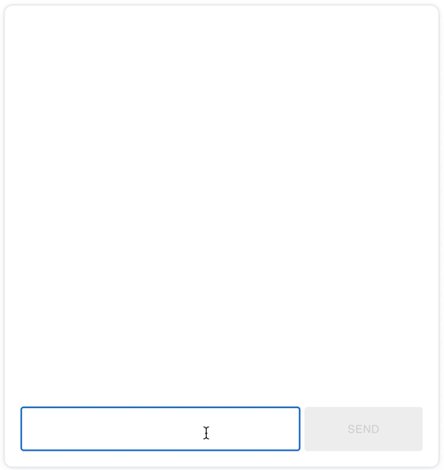
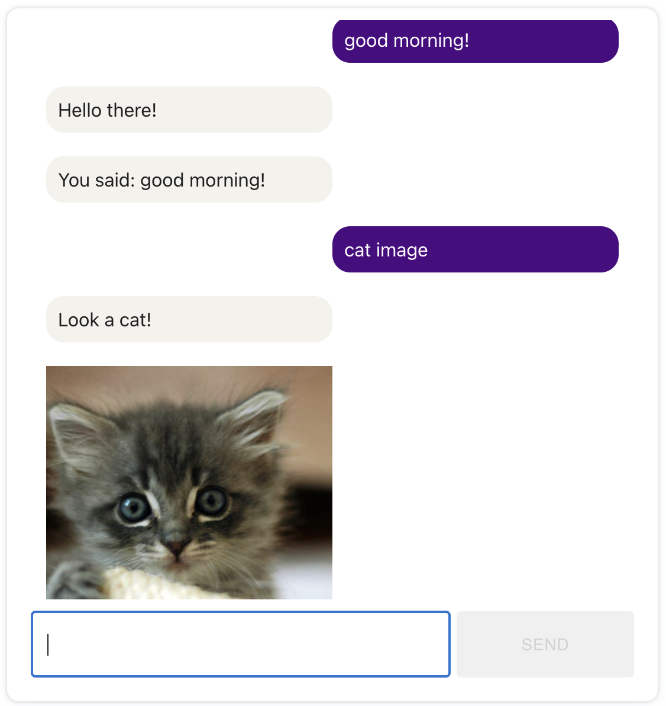
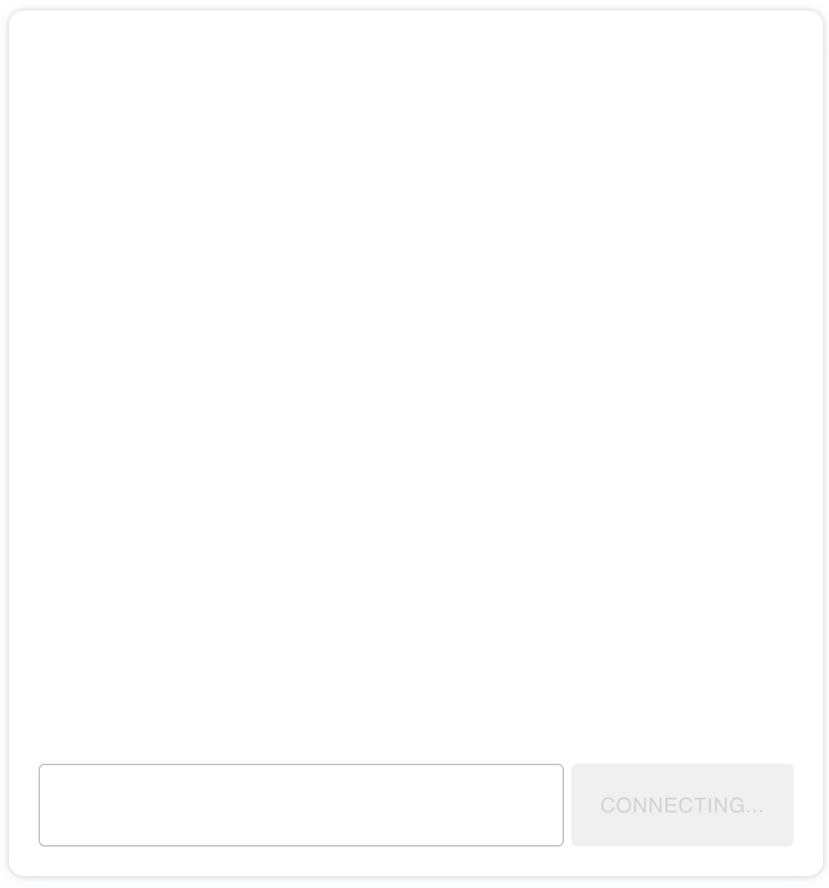
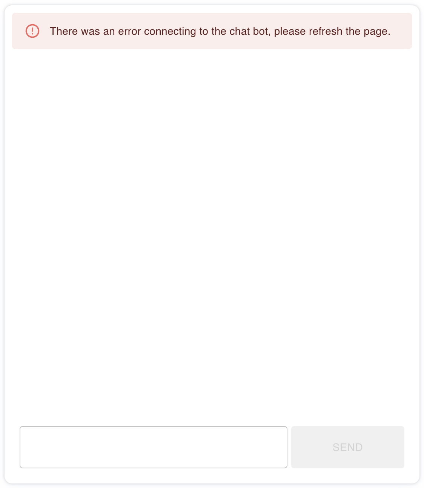
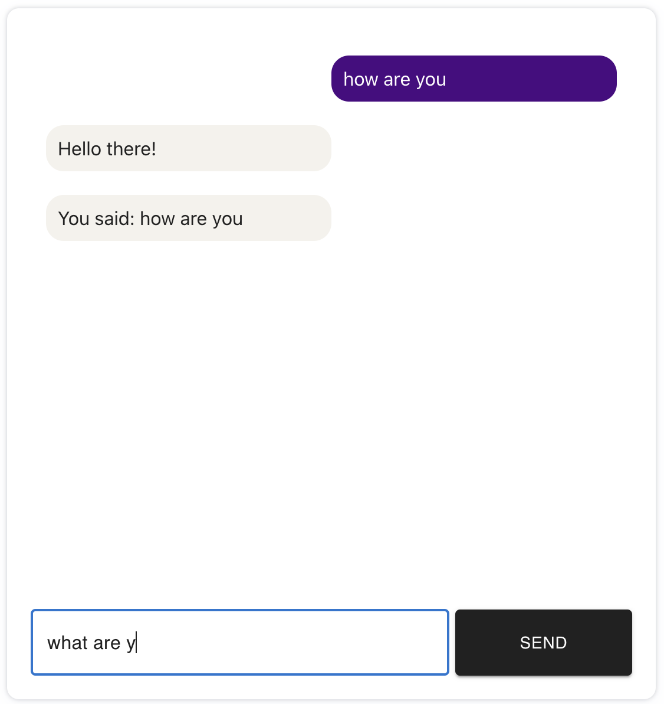

# Cognigy Frontend Developer Challenge 🤖 

This repo contains the app requested as part of Cognigy's frontend developer challenge.

<p align="center">
  
</p>

## Install dependencies

```
npm i
```

## Run the app in development mode

```
npm start
```

## Run tests

```
npm test
```

## Requirements met

- ✅ Your application source code is written in TypeScript.
- ✅ Your application connects to a predefined existing Cognigy.AI bot.
- ✅ Your application features a "text input" field with a "send" button.
  - ✅ Both "clicking the send button" and "hitting return" should submit your message.
- ✅ Messages should be sent/received through our SocketClient.
- ✅ Incoming and outgoing messages should be visually rendered in a chat history with "message
  bubbles".
- ✅ The incoming and outgoing "message bubbles" should be distinguishable by alignment and color.
- ✅ Add loading state.

## Optional requirements solved

- ✅ Support for Image Messages.
- ✅ Automated Tests

## Added feature

- ✅ Scroll to the bottom automatically when messages are sent from the bot or added by the user.

## Screenshots

### Default state



### Loading



### Error



### Typing a message


